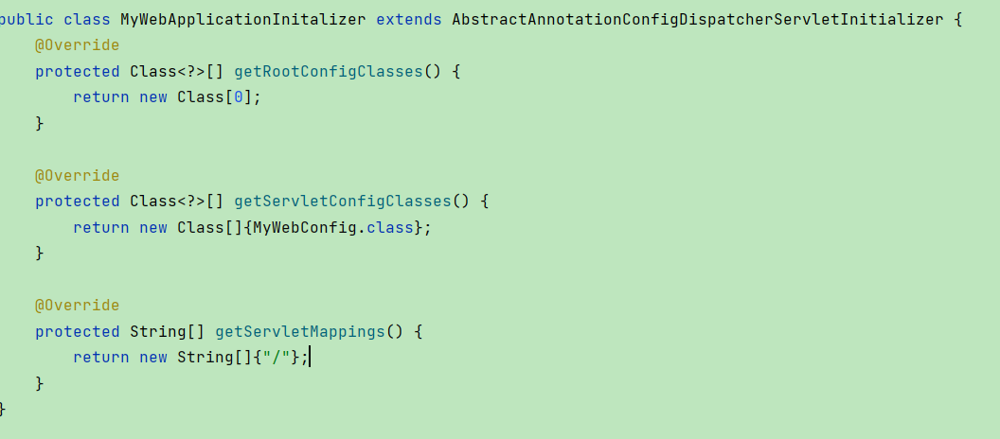
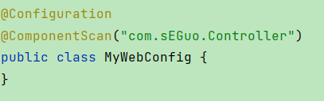
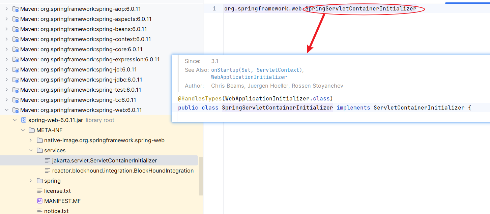
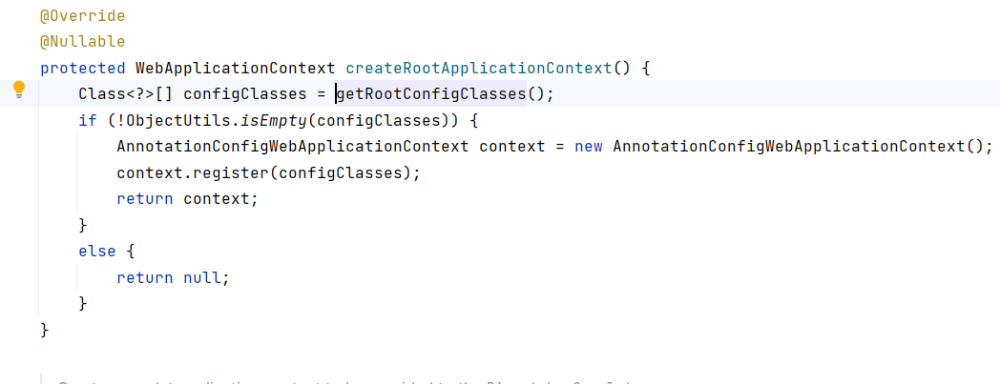
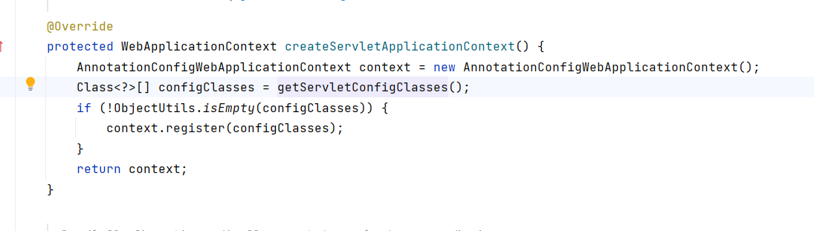
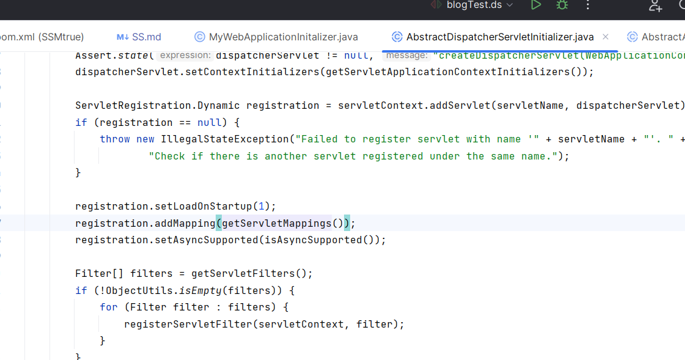

## Spring和Spring-webmvc结合

详情从commit：Hello spring-webmvc(f40837da)看起

如图我们已经有对应的配置文件。然后我们来探究一下究竟是如何实现的。

### SPI

由于SPI的存在，在运行springmvc启动时，我们会看到该类会去处理WebApplicationInitializer.class

### WebApplicationInitializer.class
我们发现我们的类继承自AbstractAnnotationConfigDispatcherServletInitializer

往顶层一直点去就会发现，实际上我们的类是WebApplicationInitializer的实现类

### 重写的method
#### 1. getRootConfigClasses

#### 2. getServletConfigClasses

#### 3. getServletMappings

由于SPI的存在，在运行springmvc启动时，我们会看到该类会去处理WebApplicationInitializer.class

